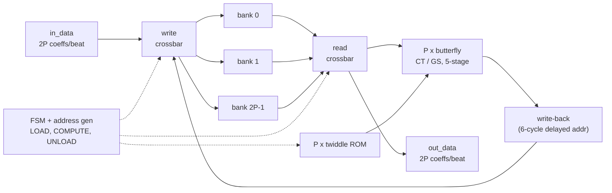
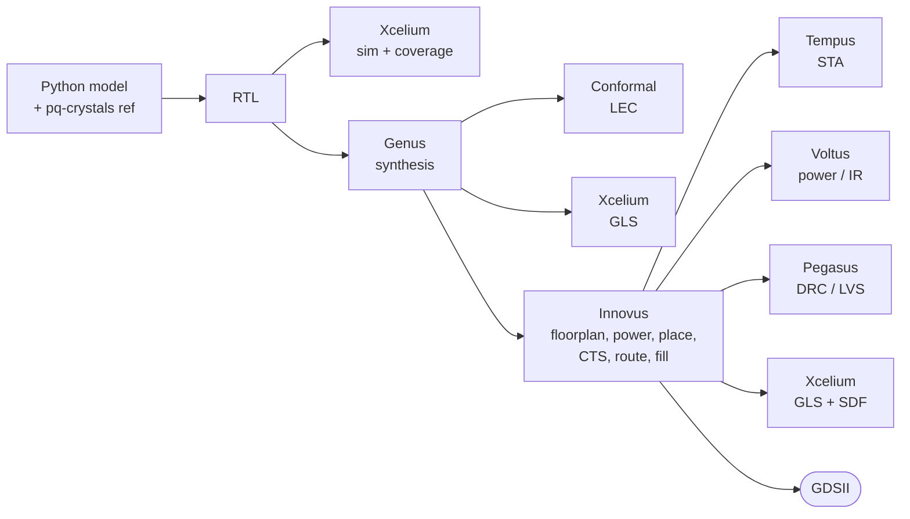

# NTT Accelerator for Post-Quantum Cryptography: RTL to GDSII (45 nm)

A parameterized hardware accelerator for the **Number-Theoretic Transform (NTT)**, the core
operation of the NIST post-quantum standards **ML-KEM (Kyber)** and **ML-DSA (Dilithium)**.
Taken from a Python golden model through Verilog RTL, verification, synthesis, equivalence
checking, place & route and sign-off to a GDSII layout on Cadence **GPDK045**.

The project is a design-space study along two axes:

* **Modular reduction:** Barrett vs. Montgomery, same pipeline depth, compared on area and timing.
* **Parallelism:** 1, 2 or 4 butterflies per clock over a conflict-free banked memory,
  compared on throughput vs. area and on routing congestion after placement.

| | |
|---|---|
| **Languages** | Verilog-2001 (RTL + testbenches), Python (golden model, vector generation, PPA scripts), Tcl |
| **Cadence tools** | Xcelium (sim + coverage, GLS with SDF), Genus, Conformal LEC, Innovus, Tempus, Voltus, Pegasus |
| **Open-source checks** | Icarus Verilog regression, Yosys gate-level simulation (also in CI) |
| **Technology** | Cadence GPDK045 / gsclib045 (45 nm) |

---

## Architecture



| Parameter | Values | Meaning |
|---|---|---|
| `SCHEME` | 0 = Kyber, 1 = Dilithium | q = 3329 / 8380417, 12 / 23-bit coefficients, 7 / 8 NTT layers |
| `RED` | 0 = Barrett, 1 = Montgomery | modular reduction inside the multiplier |
| `P` | 1, 2, 4 | butterflies per clock (2P memory banks) |

**Butterfly** (`rtl/ntt_butterfly.v`): one unit does both directions.
* Forward NTT uses Cooley-Tukey: `a + b*w, a - b*w`.
* Inverse NTT uses Gentleman-Sande: `(a+b)/2, ((a-b)/2)*w`.

  The `/2` per inverse layer folds the final `n^-1` scaling into the butterflies, so no extra
  pass or multiplier is needed. Pipeline: pre-add, 3-stage modular multiplier, post-add.

**Modular multiplier** (`rtl/ntt_modmul.v`):
* *Barrett*: `t = floor(p*M / 2^2W)`, `r = p - t*q`, one conditional subtract. Only the
  low W+1 bits of `p - t*q` are computed.
* *Montgomery*: `R = 2^W`, `m = (p mod R)*(-q^-1) mod R`, `r = (p + m*q)/R`, one conditional
  subtract. Twiddles are stored pre-multiplied by R, so the outputs are in the standard
  domain with no conversion step.

**Conflict-free memory** (`rtl/ntt_core.v`): 256 coefficients sit across 2P single-port banks.
* `bank(i)` is the XOR-fold of address `i` in `log2(2P)`-bit fields, and `offset(i) = i >> log2(2P)`.
* Each cycle, the 2P coefficients being touched differ only in address bits covering every
  residue mod `log2(2P)`, so they always fall in distinct banks. This holds for every NTT
  layer, for loads and for unloads.
* The golden model asserts this on every simulated cycle.

**Cycle counts** (measured in RTL simulation; the testbench checks them against the model):

| Compute cycles per transform | P = 1 | P = 2 | P = 4 |
|---|---|---|---|
| Kyber (7 layers) | 938 | 490 | 266 |
| Dilithium (8 layers) | 1072 | 560 | 304 |
| Load / unload beats (each) | 128 | 64 | 32 |

Data ordering matches the pq-crystals reference: the forward NTT takes normal order and
returns bit-reversed order; the inverse NTT does the reverse. All outputs are fully reduced
to `[0, q)`.

---

## Verification

| Level | What is checked | Result |
|---|---|---|
| Golden model vs **official pq-crystals C** | NTT and INTT for Kyber and Dilithium, 55 polynomials each | bit-exact |
| Golden model vs **math** | NTT, then pointwise / base multiply, then INTT, equals schoolbook negacyclic multiplication | exact |
| Barrett / Montgomery reducers | Kyber: **exhaustive**, all 11,082,241 products each. Dilithium: 200k random + corners | pre-correction value always < 2q |
| Hardware model | bank map + lane schedule + reducers, all 12 configs; bank-conflict assertion every cycle | 413,840 assertions pass |
| **RTL regression** (`make regress`) | 12 core configs (forward, inverse, round trip, random valid/ready stalls) + 4 modmul units | **947,460 checks, 0 errors** |
| Gate-level (`make gls-yosys`) | Yosys-synthesized netlist through the same testbench | pass |
| Mutation sanity | injected bugs (wrong drain depth, broken bank hash) | caught by the testbench |
| Xcelium + coverage | same testbench, block/expression/toggle/FSM coverage | run on lab tools |
| Conformal LEC | RTL vs Genus netlist | run on lab tools |
| Post-route GLS | Innovus netlist + SDF in Xcelium | run on lab tools |

---

## RTL-to-GDSII flow



### Open-source checks (any Linux box, also run in CI)

```bash
sudo apt install iverilog yosys gcc python3-numpy
make model          # golden model vs pq-crystals reference
make regress        # all 12 RTL configurations
make gls-yosys      # gate-level sanity check
```

### Cadence flow (lab machine)

```bash
cp flow/config.example.tcl flow/config.tcl
flow/find_pdk.sh /path/to/gpdk045           # paste the printed paths into flow/config.tcl

make xrun-all                                # Xcelium regression + merged coverage
make waves SCHEME=kyber RED=barrett P=2      # 1-polynomial run with waveforms, opens SimVision
make flow SCHEME=kyber RED=barrett P=2 CLK=3.0   # syn -> lec -> pnr -> sta -> power -> GDSII
make gls     SCHEME=kyber RED=barrett P=2    # post-synthesis gate-level sim
make gls-sdf SCHEME=kyber RED=barrett P=2    # post-route gate-level sim with SDF
make drc lvs SCHEME=kyber RED=barrett P=2    # deck-based checks (flow/pv/README.md)

make sweep                                   # Genus on all 12 configs, then results/ppa.md
PNR=1 SCHEMES=kyber make sweep               # + Innovus/Tempus: congestion vs P study
```

All outputs go to `build/<scheme>_<reduction>_p<P>/{syn,pnr,sta,power}`. The GDSII is
`build/<cfg>/pnr/out/ntt_top.gds`.

---

## Results (gpdk045, slow corner)

> Filled in from `make sweep` / `make ppa` (writes `results/ppa.md` and `results/ppa.png`).

| Config | Cell area (um^2) | fmax (MHz) | Cycles/NTT | Latency (us) | kNTT/s | Power (mW) | ATP |
|---|---|---|---|---|---|---|---|
| kyber_barrett_p1 | | | 938 | | | | |
| kyber_barrett_p2 | | | 490 | | | | |
| kyber_barrett_p4 | | | 266 | | | | |
| kyber_montgomery_p1 | | | 938 | | | | |
| kyber_montgomery_p2 | | | 490 | | | | |
| kyber_montgomery_p4 | | | 266 | | | | |
| dilithium_barrett_p1..p4 | | | 1072 / 560 / 304 | | | | |
| dilithium_montgomery_p1..p4 | | | 1072 / 560 / 304 | | | | |

Layout screenshots go in `docs/img/`.

---

## Repository layout

```
model/      golden model, self-tests, RTL constant/ROM generator, test-vector generator
ref/        official CRYSTALS reference NTT (C) + harness used for cross-checking
rtl/        ntt_top, ntt_core, ntt_butterfly, ntt_modmul, ntt_bank, ntt_tw_rom (generated)
tb/         self-checking testbenches (core, modmul); GLS mode via `define GLS
flow/       Cadence scripts: genus/ conformal/ innovus/ tempus/ voltus/ xcelium/ pv/, SDC
scripts/    regression, Yosys GLS, design-space sweep, PPA collection
docs/       week plan, notes, layout screenshots
```

PDK files (Liberty, LEF, QRC, GDS, rule decks) are under NDA and are never committed.
`flow/config.tcl` points to them on your machine and is git-ignored.
